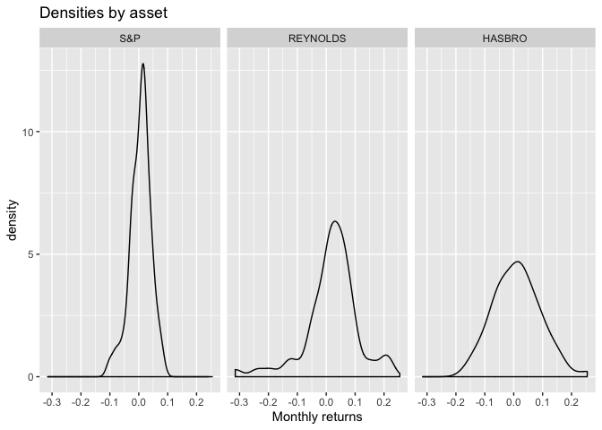
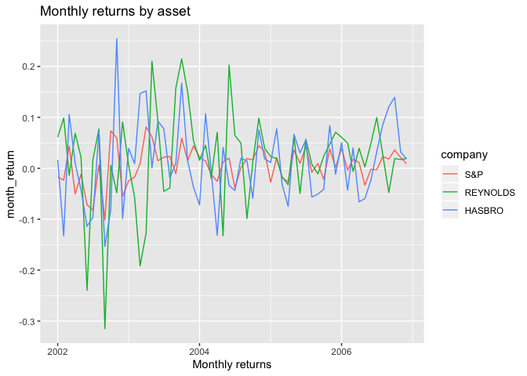
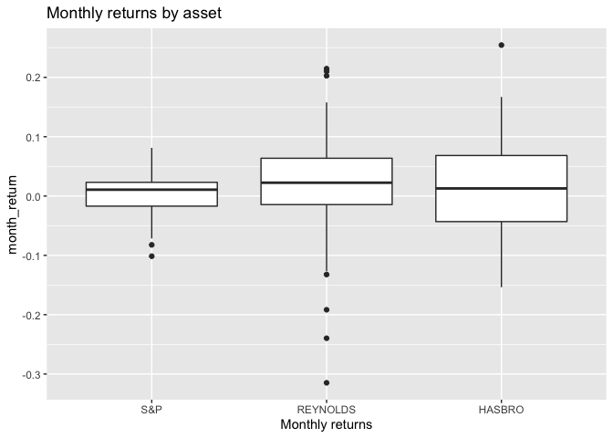

Sharpe’s Portfolio
================
Benjamin Sas Trakinsky

Libraries

``` r
library(tidyverse)
library(readxl)
library(FinCal)
library(lubridate)
library(reshape)
library(knitr)
```

Import Data and cleaning

``` r
setwd("/Users/bsastrakinsky/Dropbox/Spring_2020/MPT/week3/")
df <- read_excel("case_data.xlsx")

df <- read_excel("case_data.xlsx")


# Make date Lubridate friendly
df$Date <- sub("-0","-200",df$Date, fixed = TRUE)
df$Date <- paste(df$Date,"-01",sep="")
df$Date <- myd(df$Date)


df <- df %>% 
  cbind(id=seq(1:length(df$`S&P`)))

# Tidy-dataset
long_df <- df %>% melt(id=c("Date","id"))

long_df <- long_df %>% 
  transmute(date= Date,
            company = variable,
            month_return = value,
            year = year(date),
            month = month(date))

head(long_df)
```

    ##         date company month_return year month
    ## 1 2002-01-01     S&P      -0.0170 2002     1
    ## 2 2002-02-01     S&P      -0.0231 2002     2
    ## 3 2002-03-01     S&P       0.0437 2002     3
    ## 4 2002-04-01     S&P      -0.0506 2002     4
    ## 5 2002-05-01     S&P      -0.0119 2002     5
    ## 6 2002-06-01     S&P      -0.0715 2002     6

## Exploratory Analysis

Let’s check how the returns are distributed across the three assets.

``` r
# Densities
long_df %>% 
  ggplot(aes(x=month_return)) +
  geom_density() +
  facet_wrap(~company) +
  xlab("Monthly returns") +
  ggtitle("Densities by asset")
```

<!-- -->

We can see that the S\&P 500 is well concentrated in the 0.0-0.05 range,
with a slight positive skew. Reynolds and Hasbro both have a larger
variance, but reynolds has fatter tails.

``` r
# Graph returns
long_df %>% 
  ggplot(aes(x=date,y=month_return))+
  geom_line(mapping = aes(color=company)) +
  xlab("Monthly returns") +
  ggtitle("Monthly returns by asset")
```

<!-- -->

Not much we can say from this figure, except that all assets usually
have negative returns, and that the S\&P 500 seems to have a smaller
variance.

``` r
# Boxplot
long_df %>%
  ggplot(aes(x=company,y=month_return)) +
  geom_boxplot() +
    xlab("Monthly returns") +
  ggtitle("Monthly returns by asset")
```

<!-- -->

The median return of reynolds is the largest, and seems to have a
smaller variance than reynolds. The S\&P has the lowest median return
but the smallest variance in the interquantile
range.

## Q1. Estimate and compare the returns and variability (i.e., standard deviation of returns over the prior 5 years) of Reynolds and Hasbro with that of the S\&P 500 Index. Which security appears to be the riskiest?

Get the Data ready

``` r
# All Returns except for money weighted
month_returns <- long_df %>% 
  mutate(rel_return = month_return+1) %>% 
  group_by(company) %>% 
  summarise(hpr = prod(rel_return)-1,
            sd = sd(month_return),
            twr = prod(rel_return)^(1/60)-1,
            mr = mean(month_return)) 

# Money Weighted return
mwr <- tibble(
  sp = c(-1,rep(0,58),subset(month_returns,company=="S&P")$hpr),
  reynolds = c(-1,rep(0,58),subset(month_returns,company=="REYNOLDS")$hpr),
  hasbro = c(-1,rep(0,58),subset(month_returns,company=="HASBRO")$hpr)
)

mwr <- mwr %>% 
  summarise(sp = irr(sp),
            reynolds = irr(reynolds),
            hasbro = irr(hasbro))


# Table with all returns, need to fix mwr
mwr <- t(mwr)
# Include company vector
company <- c("S&P","REYNOLDS","HASBRO")
mwr <-  as_tibble(cbind(company,mwr))
mwr <- mwr %>% transmute(company = company, mwr = V2)

month_returns <- month_returns %>% inner_join(mwr) %>% 
  mutate(mwr = as.numeric(mwr))
```

    ## Joining, by = "company"

``` r
# Create annualized mean return (compounded) and SD
month_returns <- month_returns %>% 
mutate(mr_y = (1+mr)^12-1 , sd_y = sd*(12^.5))

# Table with everything
col <- c("Asset","Holding Period Return", "SD", "Time-Weighted Return", "Mean Return", "Money-Weighted Return","Ann Mean Return", "Ann. SD")
```

Table with returns

``` r
kable(month_returns, digits = 3,
      col.names = col, caption = "Monthly returns by asset")
```

| Asset    | Holding Period Return |    SD | Time-Weighted Return | Mean Return | Money-Weighted Return | Ann Mean Return | Ann. SD |
| :------- | --------------------: | ----: | -------------------: | ----------: | --------------------: | --------------: | ------: |
| S\&P     |                 0.357 | 0.036 |                0.005 |       0.006 |               \-0.017 |           0.071 |   0.125 |
| REYNOLDS |                 1.325 | 0.094 |                0.014 |       0.019 |                 0.005 |           0.250 |   0.324 |
| HASBRO   |                 0.679 | 0.081 |                0.009 |       0.012 |               \-0.007 |           0.152 |   0.281 |

Monthly returns by asset

Reynolds seems to be the riskiest asset, as it has the largest standard
deviation. Notice that is also the one with the highest holding period
return, and mean return. Annualizing the returns only expands these
differences.

## Q1 (b). Yearly returns

``` r
# What about yearly returns?
year_returns <- long_df %>%
  group_by(company,year) %>% 
  summarise(year_return = prod(1+month_return)-1) %>% 
  group_by(company) %>% 
  summarise(year_return2 = mean(year_return),
            year_sd = sd(year_return))

kable(year_returns, digits=3,
      col.names = c("Company","Year mean Return","Year SD"),
      caption = "Yearly returns by asset")
```

| Company  | Year mean Return | Year SD |
| :------- | ---------------: | ------: |
| S\&P     |            0.078 |   0.192 |
| REYNOLDS |            0.213 |   0.269 |
| HASBRO   |            0.171 |   0.441 |

Yearly returns by asset

Actual values for the returns on a yearly basis are very different from
the annualized monthly values. Standard deviation is much higher, and
year returns are higher. It is important to note that these calculations
are made with very few data
points.

## Q2. Suppose Sharpe’s position had been 99% of equity funds invested in the S\&P 500 Index and either 1% in Reynolds or 1% in Hasbro. Estimate the resulting portfolio position. How does each stock affect the variability of the overall equity portfolio investment? How does this relate to your answer in question 1 above?

Data prep

``` r
portfolios <- df %>% 
  transmute(sp_reynolds = .99*(df$`S&P`)+.01*(REYNOLDS),
            sp_hasbro = .99*(df$`S&P`)+.01*(HASBRO),
            date= Date)

portfolios <- portfolios %>% 
  cbind(id=seq(1,length(portfolios$date)))

# Do all the same calculations for portfolios

# Tidy-dataset (portfolio)
long_portfolios <- portfolios %>% melt(id=c("date","id"))
long_portfolios <- long_portfolios %>% 
  transmute(date= date,
            company = variable,
            month_return = value)

# Returns
portfolios_returns <- long_portfolios %>% 
  mutate(rel_returns = (1+month_return)) %>% 
  group_by(company) %>% 
  summarise(hpr = prod(rel_returns)-1,
         mr = mean(month_return),
         twr = prod(rel_returns)^(1/60)-1,
         sd = sd(month_return))


# Money Weighted return
portfolio_mwr <- tibble(
  sp_reynolds = rep(0,60),
  sp_hasbro = rep(0,60))

portfolio_mwr$sp_reynolds[1] = -1
portfolio_mwr$sp_hasbro[1] = -1
portfolio_mwr$sp_reynolds[60] = subset(portfolios_returns,company=="sp_reynolds")$hpr
portfolio_mwr$sp_hasbro[60] = subset(portfolios_returns,company=="sp_hasbro")$hpr


portfolio_mwr <- portfolio_mwr %>% 
  summarise(sp_reynolds = irr(sp_reynolds),
            sp_hasbro = irr(sp_hasbro))

# Put all together
portfolio_mwr <- as_tibble(t(portfolio_mwr))
portfolio_mwr <- portfolio_mwr %>%  transmute(mwr = V1, company = c("sp_reynolds","sp_hasbro"))


# Inner join
portfolios_returns <- portfolios_returns %>% inner_join(portfolio_mwr)
```

    ## Joining, by = "company"

``` r
# Add annualized variables
portfolios_returns <- portfolios_returns %>% 
mutate(mr_y = (1+mr)^12-1 , sd_y = sd*(12^.5))

# Join with other returns
month_returns <- month_returns %>% 
  mutate(mwr = as.numeric(mwr))

final_returns <- month_returns %>% full_join(portfolios_returns)
```

    ## Joining, by = c("company", "hpr", "sd", "twr", "mr", "mwr", "mr_y", "sd_y")

Table including the portfolio
returns

``` r
kable(final_returns, digits = 3, col.names = col)
```

| Asset        | Holding Period Return |    SD | Time-Weighted Return | Mean Return | Money-Weighted Return | Ann Mean Return | Ann. SD |
| :----------- | --------------------: | ----: | -------------------: | ----------: | --------------------: | --------------: | ------: |
| S\&P         |                 0.357 | 0.036 |                0.005 |       0.006 |               \-0.017 |           0.071 |   0.125 |
| REYNOLDS     |                 1.325 | 0.094 |                0.014 |       0.019 |                 0.005 |           0.250 |   0.324 |
| HASBRO       |                 0.679 | 0.081 |                0.009 |       0.012 |               \-0.007 |           0.152 |   0.281 |
| sp\_reynolds |                 0.368 | 0.036 |                0.005 |       0.006 |               \-0.017 |           0.073 |   0.124 |
| sp\_hasbro   |                 0.361 | 0.036 |                0.005 |       0.006 |               \-0.017 |           0.072 |   0.125 |

The two portfolios S\&P 500 + reynolds and hasbro have almost all the
same properties in terms of mean return and sd. Is only after
annualizing that we can see that SP500 + reynolds has a slightly smaller
variance. Why is this so? Let’s check the correlations.

``` r
cor(df$`S&P`,df$HASBRO)
```

    ## [1] 0.6300904

``` r
cor(df$`S&P`,df$REYNOLDS)
```

    ## [1] 0.2829252

Lower correlation of SP500 and
reynolds.

## Q3. Attempt to perform a regression of each stock’s monthly returns on the S\&P 500 Index returns to compute a “beta” for each stock (note: use Excel/Numbers functions to run the regression and/or calculate the beta). How does this relate to your answer in question 2 above?

``` r
# I need to add the SPY returns as a new variable
df_spy <- df %>% transmute(date = Date,spy=`S&P`)

# Merge with long_df
long_df <- long_df %>% inner_join(df_spy)
```

    ## Joining, by = "date"

``` r
# Variables for reg
long_df <- long_df %>% 
  mutate(risk_free = .018^(1/12) ,
         return = month_return-risk_free,
         market_return = spy-0.03)

mreynolds <- long_df %>% 
  filter(company=="REYNOLDS") %>% 
  lm(return ~ market_return,.)
```

Regression for Reynolds

``` r
summary(mreynolds) # Beta for reynolds is 0.735
```

    ## 
    ## Call:
    ## lm(formula = return ~ market_return, data = .)
    ## 
    ## Residuals:
    ##       Min        1Q    Median        3Q       Max 
    ## -0.254716 -0.032667  0.008027  0.055702  0.173462 
    ## 
    ## Coefficients:
    ##               Estimate Std. Error t value Pr(>|t|)    
    ## (Intercept)   -0.67890    0.01414 -48.012   <2e-16 ***
    ## market_return  0.73576    0.32752   2.246   0.0285 *  
    ## ---
    ## Signif. codes:  0 '***' 0.001 '**' 0.01 '*' 0.05 '.' 0.1 ' ' 1
    ## 
    ## Residual standard error: 0.09061 on 58 degrees of freedom
    ## Multiple R-squared:  0.08005,    Adjusted R-squared:  0.06419 
    ## F-statistic: 5.047 on 1 and 58 DF,  p-value: 0.0285

``` r
beta_reynolds <- mreynolds$coefficients["market_return"]

mhasbro <- long_df %>% 
  filter(company=="HASBRO") %>% 
  lm(return ~ market_return,.)
```

Regression for Hasbro

``` r
summary(mhasbro) # Beta for hasbro is 1.419799
```

    ## 
    ## Call:
    ## lm(formula = return ~ market_return, data = .)
    ## 
    ## Residuals:
    ##      Min       1Q   Median       3Q      Max 
    ## -0.18984 -0.03022  0.00490  0.03773  0.16610 
    ## 
    ## Coefficients:
    ##                Estimate Std. Error t value Pr(>|t|)    
    ## (Intercept)   -0.669216   0.009919  -67.47  < 2e-16 ***
    ## market_return  1.419799   0.229754    6.18 6.88e-08 ***
    ## ---
    ## Signif. codes:  0 '***' 0.001 '**' 0.01 '*' 0.05 '.' 0.1 ' ' 1
    ## 
    ## Residual standard error: 0.06356 on 58 degrees of freedom
    ## Multiple R-squared:  0.397,  Adjusted R-squared:  0.3866 
    ## F-statistic: 38.19 on 1 and 58 DF,  p-value: 6.878e-08

``` r
beta_hasbro <- mhasbro$coefficients["market_return"]

# Store betas
beta <- c(0,beta_reynolds,beta_hasbro,NA,NA)
```

Let’s check our final table

``` r
final_returns2 <- cbind(final_returns,beta)
final_returns2 <- final_returns2 %>% 
  mutate(sharpe = (mr-.018/12)/sd)

col <- c(col,"Beta","Sharpe")

kable(final_returns2, digits = 3, col.names = col)
```

| Asset        | Holding Period Return |    SD | Time-Weighted Return | Mean Return | Money-Weighted Return | Ann Mean Return | Ann. SD |  Beta | Sharpe |
| :----------- | --------------------: | ----: | -------------------: | ----------: | --------------------: | --------------: | ------: | ----: | -----: |
| S\&P         |                 0.357 | 0.036 |                0.005 |       0.006 |               \-0.017 |           0.071 |   0.125 | 0.000 |  0.118 |
| REYNOLDS     |                 1.325 | 0.094 |                0.014 |       0.019 |                 0.005 |           0.250 |   0.324 | 0.736 |  0.184 |
| HASBRO       |                 0.679 | 0.081 |                0.009 |       0.012 |               \-0.007 |           0.152 |   0.281 | 1.420 |  0.127 |
| sp\_reynolds |                 0.368 | 0.036 |                0.005 |       0.006 |               \-0.017 |           0.073 |   0.124 |    NA |  0.122 |
| sp\_hasbro   |                 0.361 | 0.036 |                0.005 |       0.006 |               \-0.017 |           0.072 |   0.125 |    NA |  0.119 |

The beta of each asset is an indicator of the expected payment that
should be expected for taking the inherent risk of the asset. It is
interesting to see that the higher the correlation the higher the beta
is.
