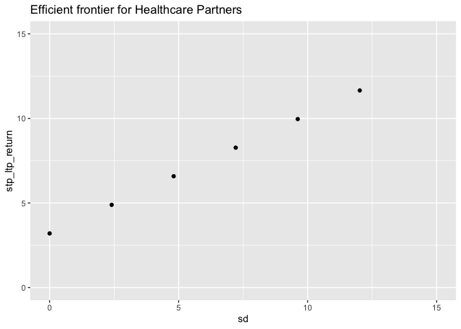
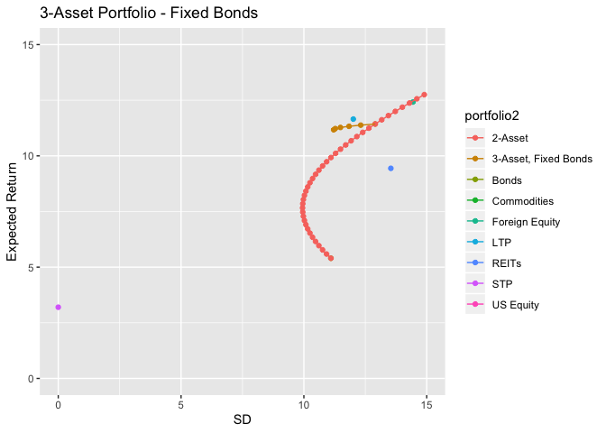
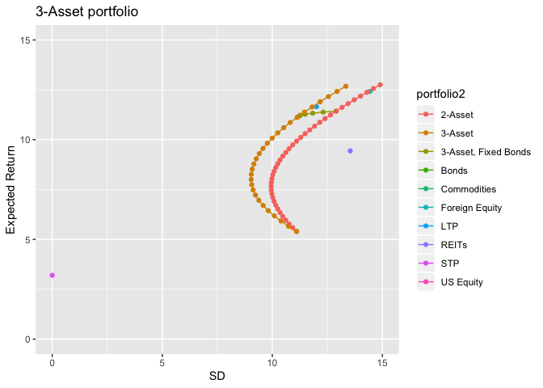

Partners Healthcare
================
Benjamin Sas Trakinsky

Partners Healthcare is a non-profit healthcare organization that manages
the endowments of healthcare practices. Its clients base is diverse
including large hospitals with research facilities, medium-sized
hospitals, and small practices across the state of Massachussets.

The investments of Partners Healthcare are managed by a centralized
investment council. The council currently uses two investment vehicles,
a short-term pool (STP) composed of short-term bonds, with a historical
annual return of 3.2%, and a long-term pool (LTP) made up of: 55% U.S.
equity, 30% foreign equity, and 15% long-term bonds. The historical
annual return of the LTP is 11.65%.

The investment council is debating if they should include more assets
into their LTP fund, specifically, they want to check if real estate
investment trusts (REITs) or commodities would make a good addition.

To solve this case we will focus on exploring the current investment
positions of Partners Healthcare, explore the idea of diversification,
and check how diversification is related to the correlation between
assets.

In order to do so we will have to take two strong assumptions. First,
historical average return of assets will be trated as their expected
return for the future. Second, we will treat asset returns as
normally-distributed and covariance stationary, this means that we will
be able to obtain the variance-covariance matrix of portfolios as the
variance of the sum of normal distributions, and that we can assume that
the historical variance and covariance between assets stays the same
across time.

Enough talk, let’s start with the code. To run this file you will need
the following libraries:

``` r
library(tidyverse)
library(quadprog)
```

The data provided in the case are the expected returns of assets, and
the correlation matrix between them.

``` r
df <- tibble(
assets = c("US Equity", "Foreign Equity", "Bonds", "REITs","Commodities"),
e_return = c(12.94, 12.42,5.40,9.44,10.55),
sd = c(15.21,14.44,11.10,13.54,18.43)
)

# Correlation matrix
corr_matrix <- cbind(
  c(1.00,   0.62,   0.25,   0.56,   -0.02),
  c(0.62,   1.00,   0.06,   0.40,   0.01),
  c(0.25,   0.06,   1.00,   0.16,   -0.07),
  c(0.56,   0.40,   0.16,   1.00,   -0.01),
  c(-0.02,  0.01,   -0.07,  -0.01,  1.00)
)
```

We need to obtain the variance-covariance matrix between assets. The
correlation matrix is easy to interpret, but not that useful to
calculate the variance of portfolios.

``` r
# Obtain var-cov matrix
stdevs <- df$sd
b <- stdevs %*% t(stdevs)  
varcov <- b * corr_matrix
colnames(varcov) <- c("US Equity", "Foreign Equity", "Bonds", "REITs","Commodities")
```

The variance-covariance matrix is:

``` r
varcov
```

    ##       US Equity Foreign Equity     Bonds      REITs Commodities
    ## [1,] 231.344100     136.172088  42.20775 115.328304   -5.606406
    ## [2,] 136.172088     208.513600   9.61704  78.207040    2.661292
    ## [3,]  42.207750       9.617040 123.21000  24.047040  -14.320110
    ## [4,] 115.328304      78.207040  24.04704 183.331600   -2.495422
    ## [5,]  -5.606406       2.661292 -14.32011  -2.495422  339.664900

## Generate STP and LTP Portfolios

Currently, Healthcare partners invests only in two assets its STP and
LTP funds. Now, we will calculate the expected return and SD of these
portfolios. The expected return of any portfolio is the linear
combination between weights and expected return of each asset. The
standard deviation (SD) of a portfolio, is calculated as the sum of the
variances of each asset multiplied by its weight squared, plus two times
all the covariance terms between assets.

``` r
# LTP asset weights
ltp <- c(.55,.30,.15,0,0)

e_ltp <- ltp%*%df$e_return # Expected returns
sd_ltp <- sqrt(t(ltp) %*% varcov %*% ltp) # SD of portfolio
ltp <- c("LTP",e_ltp,sd_ltp) #vector to store results
stp <- c("STP",3.20,0) # vector storing STP results (it has zero variance by assumption - risk free)

# Main dataframe with assets and STP and LTP
df <- rbind(df,ltp,stp)
df <- df %>%
  mutate(e_return = as.numeric(e_return),
         sd = as.numeric(sd))
```

Let’s check a graph with the expected returns and SD of each asset
available to Healthcare partners, and the LTP and STP portfolios.
<!-- -->

There seems to be a linear relationship between risk and return. The
greater returns are obtained with additional risk (in terms of SD).
Commodities seem a bit off this trend, with less return and more
variance than other assets such as U.S. equities or foreign equities.
Does it make sense to include them in a portfolio? - more on this later.

## Combination of STP and LTP portfolios

What is it currently available to Healthcare partners? It can only
invest in its STP and LTP funds, and change the allocation of its funds
towards the two of them. So if we evaluate the expected return and SD
over a wide range of weights for both funds, we will obtain the
efficient investment frontier for Healthcare partners.

``` r
# Create weight matrix
w1 <- seq(0,1,.2)
w2 <- 1-w1
w <- rbind(w1,w2)

# Use only LTP and STP funds
df2 <- df %>% filter(assets=="LTP" | assets=="STP")
stp_ltp_return <- t(w) %*% df2$e_return

# Create a dataframe for the portfolios
df2 <- df2 %>%  select(assets) %>% 
  cbind(t(w),stp_ltp_return)

# Get SD, is only based in the SD of LTP as STP has sd=0
df2 <- df2 %>% 
  mutate(sd = sqrt(12.02^2*w1^2))
```

The efficient frontier graph:

``` r
df2 %>% 
  ggplot(aes(sd,stp_ltp_return)) +
  geom_point() +
  xlim(0,15) +
  ylim(0,15) +
  ggtitle("Efficient frontier for Healthcare Partners")
```

<!-- -->

The efficient frontier is a straight line as the covariance between STP
and LTP is zero. As the allocation to LTP grows, the SD grows linearly
as there is no interacting covariance term.

## Portfolios of US equities and bonds

Our focus in the case is about the LTP fund. We want to evaluate if it
is convenient to include new assets into it. But, before we can do so we
will look further into the concept of diversification, and the efficient
investment frontier.

Let’s start with an easy case two assets: U.S. bonds, and U.S. equities,
with corresponding expected returns of 12.9% and 5.4%. What will the
efficient investment frontier look like if we change the correlation
between these assets?, Will a positive or a negative correlation provide
better hedging against risk?

So let’s check how the efficient investment frontier moves as we change
the correlation between assets:

``` r
# Weights of portfolios
w1 <- seq(0,1,.025)
w2 <- 1-w1
w <- rbind(w1,w2)

# Include only us equities and bonds
df3 <- df %>% filter(assets=="US Equity" | assets=="Bonds")

# Initial run of code, to create storing DF
corr_matrix2 <- cbind(c(1,-1),c(-1,1))
b <- df3$sd %*% t(df3$sd)  
varcov3 <- b * corr_matrix2 

# Obtain portfolios returns and sd
p1_return <- t(w) %*% df3$e_return
p1_sd <- t(diag(sqrt(t(w) %*% varcov3 %*% w)))
Corr <- (rep(-1,length(p1_sd)))

df4 <- cbind(t(w),p1_return,t(p1_sd),Corr)
```

Now we will use the same code above to loop through different
correlation values.

``` r
# Corr
s <- c(-.75,-.5,0,.25,.5,.75,1)

for (k in s) {
  corr_matrix2 <- cbind(c(1,k),c(k,1))
  b <- df3$sd %*% t(df3$sd)  
  varcov3 <- b * corr_matrix2
  
  # Obtain portfolios returns and sd
  p1_return <- t(w) %*% df3$e_return
  p1_sd <- t(diag(sqrt(t(w) %*% varcov3 %*% w)))
  Corr <- (rep(k,length(p1_sd)))  
  
  df_aux <- cbind(t(w),p1_return,t(p1_sd),Corr)
  
  df4 <- rbind(df4,df_aux)
}

# modify DF4
df4 <- as_tibble(df4) %>% 
  mutate(e_return = V3,
         sd = V4) %>% 
  select(w1,w2,Corr,e_return,sd)
```

The efficient frontier for different correlation values is:
<!-- -->

Two cases are relevant, when the correlation between assets is -1, risk
can be completely hedged at a portfolio with SD of zero. When the
correlation between assets is 1 the portfolios moves as a straight line,
as the inclusion of more of the other asset does nothing to offset the
SD through the covariance term. Any intermmediate case will be
curve-shaped as the covariance terms gain more influence as we increase
the asset mix.

## 3-Asset Portfolio - Fixed Bonds

Now we will explore the efficient frontier for a 3-asset portfolio of:
US equities, Foreign equities, and US bonds. To simplify the analysis
the allocation of bonds will be fixed at 20%. What will vary is the
allocations toward foreign and US equities.

``` r
w3 <- rep(0.2,6)
w1 <- c(0.30,0.40,0.50,0.60,0.70,0.80)
w2 <- 1-w3-w1
w <- cbind(w1,w2,w3)

# New Data frame
df5 <- df %>% filter(assets=="US Equity" | assets=="Foreign Equity" | assets=="Bonds")

# Variance covariance matrix of assets
varcov4 <- varcov[1:3,1:3]

# Obtain expected returns and sd of each portfolio
p2_return <- w %*% df5$e_return
p2_sd <- sqrt(diag(w %*% varcov4 %*% t(w))) 

df6 <- cbind(w,p2_return,p2_sd)
df6 <- as_tibble(df6)
df6 <- df6 %>% mutate(e_return=V4, sd = p2_sd, portfolio = rep("3-Asset, Fixed Bonds"))
df6 <- df6 %>% select(w1,w2,w3,e_return,sd,portfolio)

# Add the STP and LTP portfolios, and assets
df6 <- df6 %>% full_join(df)

df6 <- df6 %>% mutate(portfolio2 = portfolio %>% 
                 is.na() %>% 
                 ifelse(assets,portfolio)) 

# add the two-asset portfolio with 0.25 correlation (the original)
df_aux <- df4 %>% filter(Corr==0.25) %>% 
  select(w1,w2,e_return,sd) %>% 
  mutate(portfolio2="2-Asset")

df6 <- df6 %>% full_join(df_aux)
```

Let’s check the graph for this new portfolio and compare it with the
previous 2-asset portfolio.
<!-- -->

The 3-asset portfolio is clearly better than the 2-asset portfolio of US
bonds and equities. The inclusion of an additional asset (foreign
equities) diversifies the portfolios, and for each level of expected
return the 3-asset portfolio has an equal or lower SD than the 2-asset
portfolio.

## Varying 3-asset portfolio

The real game starts now. When we create portfolios with three and more
assets there might be several weight allocations to the assets that
produce the same expected return. To find the efficient frontier we need
to find the minimum variance portfolio, at each level of expected
return.

What we will do is use a quadratic programming approach. We will
minimize the variance of the portfolio for each level of expected
returns. The result of the optimization will be the ideal weights for
each asset. As it is the first time we use this method I will go step by
step.

1.  Grab the expected returns and variance covariance matrix

<!-- end list -->

``` r
returns_aux <- df$e_return[1:3]
varcov_aux <- varcov[1:3,1:3]
```

2.  Set up the neccesary matrices for optimization 2.1. Matrix that
    multiplies the linear constraints (A)

<!-- end list -->

``` r
Amat <- cbind(rep(1, 3), returns_aux, diag(1,nrow = 3),diag(1,nrow = 3))
```

2.2. Define the sequence of expected returns we will evaluate. I
arbitrarily chose 30 points. What matters is that these points need to
be in the interior of the solution space (Portfolio return cannot exceed
the max return of all assets, nor its
min)

``` r
mu.P <- seq(min(returns_aux) + 1e-04, max(returns_aux) - 1e-04, length = 30)
```

2.3. Create matrices to store results

``` r
# Matrix to store SD results
sigma.P <- mu.P
# Matrix to store weight results (allocations)
weights <- matrix(0, nrow = 300, ncol = 3)
```

2.4. Optimize for each expected return level

``` r
# Optimize for each chosen expected return level.
for (i in 1:length(mu.P)) {
  
  # restrictions, 1: weights have to add up to one
  #               2: linear combination of portfolios equals portfolio expected return inputted
  #               3: allocations have to be equal or greater than zero (non-shorting)
  #               4: allocations cannot exceed one (non-borrowing)
  
  bvec <- c(1, mu.P[i], rep(0, 3),rep(-1,3))  # constraint vectors with the restrictions above
  result <- solve.QP(Dmat = 2 * varcov_aux, 
                     dvec = rep(0, 3), Amat = Amat, 
                     bvec = bvec, meq = 2) # Quadratic optimization (minimizing variance at specified returns)
  sigma.P[i] <- sqrt(result$value) # add results of loop to matrix
  weights[i, ] <- result$solution  # add results of loop to matrix
}
```

3.  Add the new results to the relevant dataframe

<!-- end list -->

``` r
df_aux <- as_tibble(cbind(mu.P,sigma.P)) %>% 
  rename(e_return = mu.P, sd = sigma.P) %>% 
  filter(e_return>=0) %>% 
  mutate(portfolio2="3-Asset")

# Join with df6
df6 <- df6 %>% full_join(df_aux)
```

4.  The results of the optimization are stored in the weights matrix,
    the standard deviation of each portfolio is in sigma.P. The 3-Asset
    efficeint frontier portfolio graph
is:

<!-- -->

The figure reflects the importance of optimizing the allocation weights.
The portfolio with fixed 20% on bonds is clearly inferior to the 3-Asset
optimal portfolio at every level of expected return. The lesson from
this is that imposing a 20% allocation to bonds is an active contraint,
and that it will result in portfolios with higher SD at equal expected
return levels.

## 4-Asset Portfolio

Now we will evaluate two types of portfolios, the same 3-asset portfolio
from the last section but including REITs and another including
Commodities.

``` r
list <- c("REITs","Commodities")
i = 1 # loop counter

# Loop thorugh the new assets
for (k in list){
  
  # Get for returns and sd
  returns_aux <- df %>% filter(assets=="US Equity" | assets=="Foreign Equity" | assets=="Bonds" | assets==k) %>% 
    select(e_return)
  
  # Optimize
  
  if (i==1){
    varcov_aux = varcov[1:4,1:4]
  }
  if (i==2){
    varcov_aux = varcov[c(1,2,3,5),c(1,2,3,5)]
  }
  
  # Create A-matrix for linear constraints
  Amat <- cbind(rep(1, 4), returns_aux, diag(1,nrow = 4),diag(1,nrow = 4)) # last row is identity matrix for non-negativity constraints
  # Expected returns to loop through
  mu.P <- seq(min(returns_aux) + 1e-04, max(returns_aux) - 1e-04, length = 30) # expected returns of portfolio to try
  # Matrix to store SD results
  sigma.P <- mu.P
  # Matrix to store weight results (allocations)
  weights <- matrix(0, nrow = 30, ncol = 4)
  
  # Optimize for each chosen expected return level.
  for (i in 1:length(mu.P)) {
    
    # restrictions, 1: weights have to add up to one
    #               2: linear combination of portfolios equals portfolio expected return inputted
    #               3: allocations have to be equal or greater than zero (non-shorting)
    #               4: allocations cannot exceed one (non-borrowing)
    
    bvec <- c(1, mu.P[i], rep(0, 4),rep(-1,4))  # constraint vectors with the restrictions above
    result <- solve.QP(Dmat = as.matrix(2 * varcov_aux), 
                       dvec = rep(0, 4), Amat = as.matrix(Amat), 
                       bvec = bvec, meq = 2) # Quadratic optimization (minimizing variance at specified returns)
    sigma.P[i] <- sqrt(result$value) # add results of loop to matrix
    weights[i, ] <- result$solution  # add results of loop to matrix
  }
  
  aux <- as_tibble(round(weights,3))

  
  # Aux dataframe
  asset <- "4-Asset:Includes "
  asset <- paste(asset,k)
  
  df_aux <- as_tibble(cbind(mu.P,sigma.P)) %>% 
    rename(e_return = mu.P, sd = sigma.P) %>% 
    filter(e_return>=0) %>% 
    mutate(portfolio2= asset)
  
  # Join with df6
  df6 <- df6 %>% full_join(df_aux)
  
  i = i + 1 # loop counter
}  
```

Let’s see what is the result in the efficient frontier
graph

<!-- -->

Adding REITs does not make a big difference, no noticeable better
risk-adjusted returns are obtained. Adding commodities was marginally
better. Why? Commodities are negatively correlated with some of the
other assets, making its addition good to hedge risk.

## 5-Asset Portfolio

Now let’s include all assets in one portfolio and see if the efficient
frontier improves.

``` r
# Grab returns and varcov for this case
returns_aux <- df$e_return[1:5]
varcov_aux <- varcov

# Create A-matrix for linear constraints
Amat <- cbind(rep(1, 5), returns_aux, diag(1,nrow = 5),diag(1,nrow = 5)) # last row is identity matrix for non-negativity constraints
# Expected returns to loop through
mu.P <- seq(min(returns_aux) + 1e-04, max(returns_aux) - 1e-04, length = 30) # expected returns of portfolio to try
# Matrix to store SD results
sigma.P <- mu.P
# Matrix to store weight results (allocations)
weights <- matrix(0, nrow = 300, ncol = 5)


# Optimize for each chosen expected return level.
for (i in 1:length(mu.P)) {
  
  # restrictions, 1: weights have to add up to one
  #               2: linear combination of portfolios equals portfolio expected return inputted
  #               3: allocations have to be equal or greater than zero (non-shorting)
  #               4: allocations cannot exceed one (non-borrowing)
  
  bvec <- c(1, mu.P[i], rep(0, 5),rep(-1,5))  # constraint vectors with the restrictions above
  result <- solve.QP(Dmat = 2 * varcov_aux, 
                     dvec = rep(0, 5), Amat = Amat, 
                     bvec = bvec, meq = 2) # Quadratic optimization (minimizing variance at specified returns)
  sigma.P[i] <- sqrt(result$value) # add results of loop to matrix
  weights[i, ] <- result$solution  # add results of loop to matrix
}

aux <- as_tibble(round(weights,3))


# Graph
df_aux <- as_tibble(cbind(mu.P,sigma.P)) %>% 
  rename(e_return = mu.P, sd = sigma.P) %>% 
  filter(e_return>=0) %>% 
  mutate(portfolio2="5-Asset")

# Join with df6
df6 <- df6 %>% full_join(df_aux)
```

The figure including all efficient
portfolios:

<!-- -->

Clearly the best portfolio is attained by including all assets, as is
able to minmize SD at each level of expected return compared to all
other portfolios. The key about diversification is expanding the choice
set to assets with different correlations, by combining them we improve
the risk-adjusted return of the optimal portfolio.
